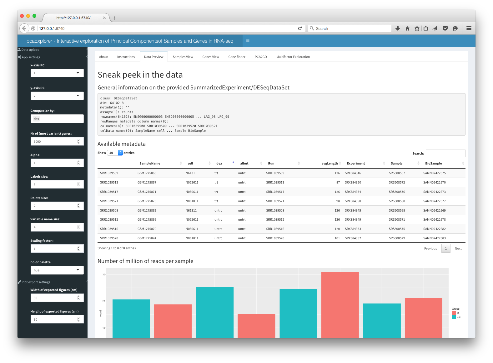
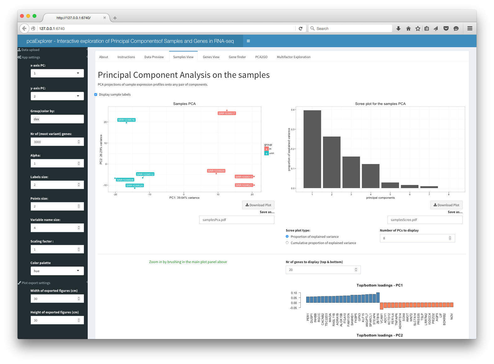
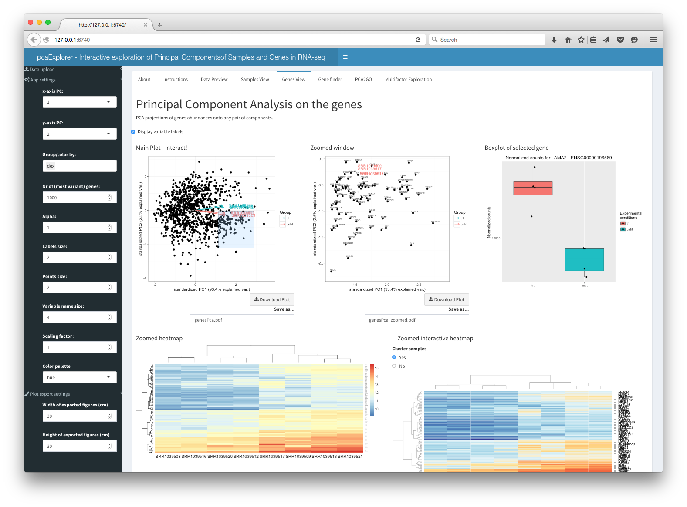
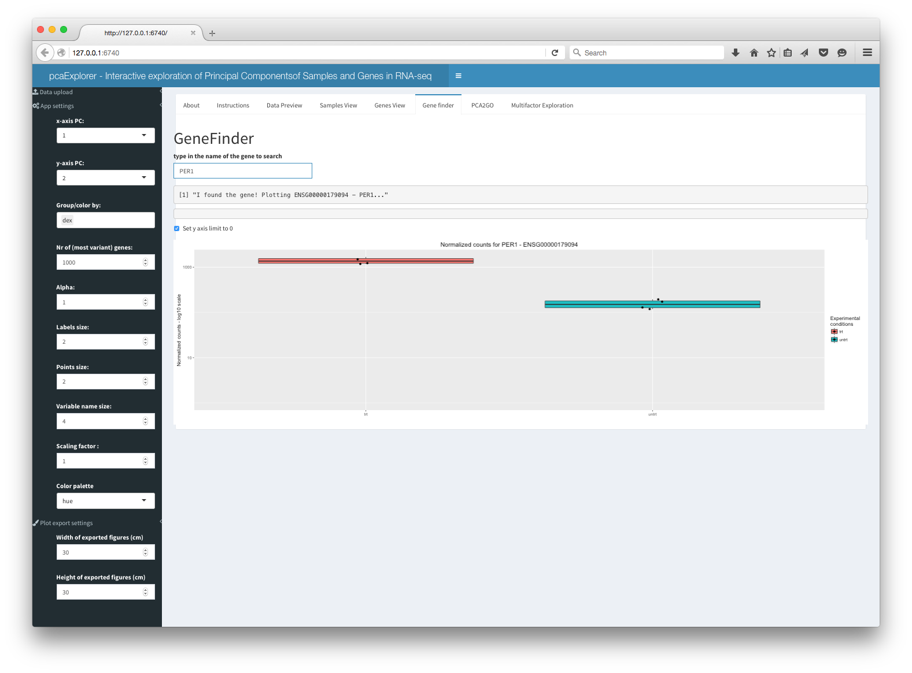
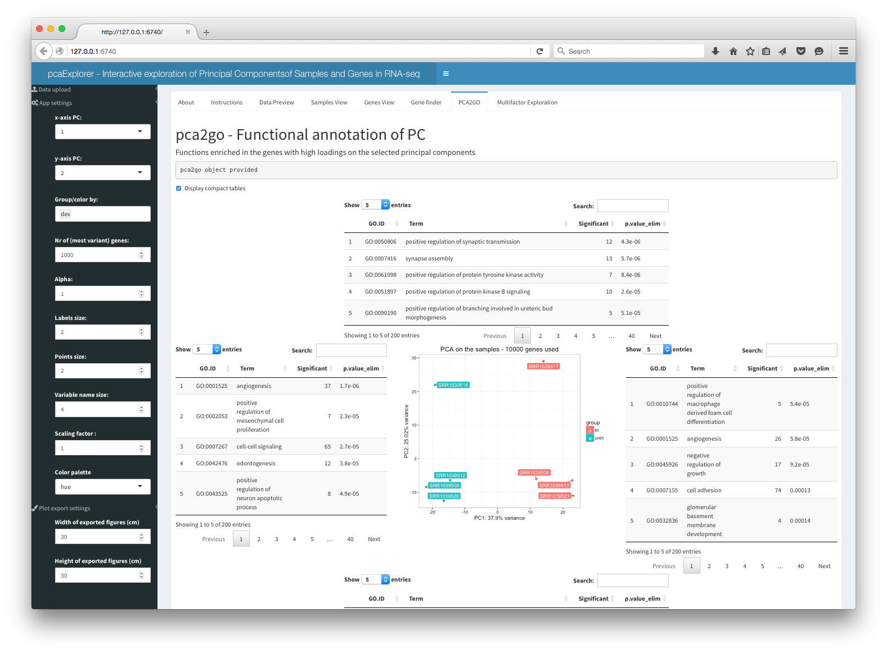
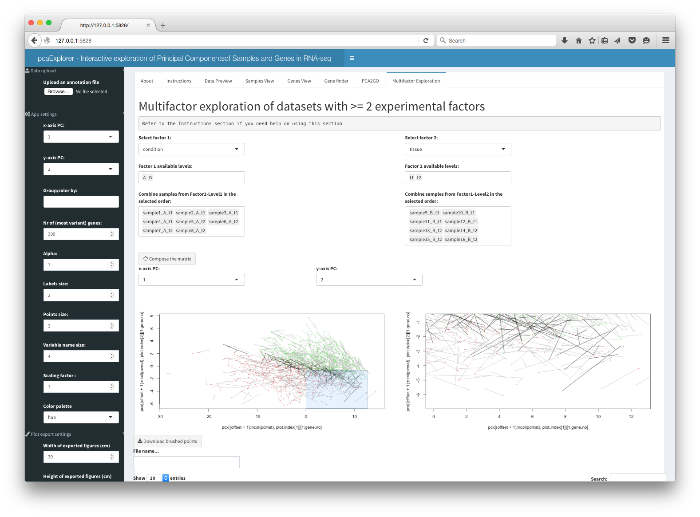

<br>
**Package**: `r Rpackage("pcaExplorer")`<br />
**Authors**: `r packageDescription("pcaExplorer")[["Author"]]`<br />
**Version**: `r packageDescription("pcaExplorer")$Version`<br />
**Compiled date**: `r Sys.Date()`<br />
**License**: `r packageDescription("pcaExplorer")[["License"]]`<br />

```{r style, echo = FALSE, results = 'asis'}
BiocStyle::markdown()
```

```{r setup, echo=FALSE, warning=FALSE}
library(knitr)
set.seed(42)
opts_chunk$set(comment=NA,
               fig.align="center",
               warning=FALSE)
```

# Getting started

`r Biocpkg("pcaExplorer")` is an R package distributed as part of the [Bioconductor](http://bioconductor.org) project. To install the package, start R and enter:

```{r installation, eval=FALSE}
source("http://bioconductor.org/biocLite.R")
biocLite("pcaExplorer")
```

Once `r Rpackage("pcaExplorer")` is installed, it can be loaded by the following command.

```{r loadlibrary, message=FALSE}
library("pcaExplorer")
```


# Introduction

`r Biocpkg("pcaExplorer")` is a Bioconductor package containing a Shiny application for
analyzing expression data in different conditions and experimental factors. 

It is a general-purpose interactive companion tool for RNA-seq analysis, which 
guides the user in exploring the Principal Components of the data under inspection.

`r Biocpkg("pcaExplorer")` provides tools and functionality to detect outlier samples, genes
that show particular patterns, and additionally provides a functional interpretation of 
the principal components for further quality assessment and hypothesis generation
on the input data. 

Moreover, a novel visualization approach is presented to simultaneously assess 
the effect of more than one experimental factor on the expression levels.

Thanks to its interactive/reactive design, it is designed to become a practical
companion to any RNA-seq dataset analysis, making exploratory data analysis 
accessible also to the bench biologist, while providing additional insight also
for the experienced data analyst.


# Launching the application

After loading the package, the `r Biocpkg("pcaExplorer")` app can be launched in different modes:

- `pcaExplorer(dds = dds, rld = rld)`, where `dds` is a `DESeqDataSet` object and `rld` is a `DESeqTransform`
object, which were created during an existing session for the analysis of an RNA-seq
dataset with the `r Biocpkg("DESeq2")` package

- `pcaExplorer(dds = dds)`, where `dds` is a `DESeqDataSet` object. The `rld` object is automatically 
computed upon launch.

- `pcaExplorer(countmatrix = countmatrix, coldata = coldata)`, where `countmatrix` is a count matrix, generated
after assigning reads to features such as genes via tools such as `HTSeq-count` or `featureCounts`, and `coldata`
is a data frame containing the experimental covariates of the experiments, such as condition, tissue, cell line,
run batch and so on.

- `pcaExplorer()`, and then subsequently uploading the count matrix and the covariates data frame through the 
user interface. These files need to be formatted as tab separated files, which is a common format for storing
such count values.

Additional parameters and objects that can be provided to the main `r Biocpkg("pcaExplorer")` function are:

- `pca2go`, which is an object created by the `pca2go` function, which scans the genes with high loadings in 
each principal component and each direction, and looks for functions (such as GO Biological Processes) that 
are enriched above the background. The offline `pca2go` function is based on the routines and algorithms of 
the `r Biocpkg("topGO")` package, but as an alternative, this object can be computed live during the execution of the app
exploiting the `goana` function, provided by the `r Biocpkg("limma")` package. Although this likely provides more general
(and probably less informative) functions, it is a good compromise for obtaining a further data interpretation.

- `annotation`, a data frame object, with `row.names` as gene identifiers (e.g. ENSEMBL ids) identical to the 
row names of the count matrix or `dds` object, and an extra column `gene_name`, containing e.g. HGNC-based 
gene symbols. This can be used for making information extraction easier, as ENSEMBL ids (a usual choice when
assigning reads to features) do not provide an immediate readout for which gene they refer to. This can be
either passed as a parameter when launching the app, or also uploaded as a tab separated text file.


# The controls sidebar

Most of the input controls are located in the sidebar, some are as well in the individual tabs of the app.
By changing one or more of the input parameters, the user can get a fine control on what is displayed.

## Data upload

These **file input** controls are available when no `dds` or `countmatrix` + `coldata` are provided. Additionally,
it is possible to upload the `annotation` data frame.

## App settings

Here are the parameters that set input values for most of the tabs. By hovering over with the mouse,
the user can receive additional information on how to set the parameter, powered by the `r CRANpkg("shinyBS")` package.

- **x-axis PC** - Select the principal component to display on the x axis
- **y-axis PC** - Select the principal component to display on the y axis
- **Group/color by** - Select the group of samples to stratify the analysis. Can also assume multiple values.
- **Nr of (most variant) genes** - Number of genes to select for computing the principal components. The top n genes are
selected ranked by their variance inter-samples
- **Alpha** - Color transparency for the plots. Can assume values from 0 (transparent) to 1 (opaque)
- **Labels size** - Size of the labels for the samples in the principal components plots
- **Points size** - Size of the points to be plotted in the principal components plots
- **Variable name size** - Size of the labels for the genes PCA - correspond to the samples names
- **Scaling factor** - Scale value for resizing the arrow corresponding to the variables in the PCA for the genes. It
should be used for mere visualization purposes
- **Color palette** - Select the color palette to be used in the principal components plots. The number of colors 
is selected automatically according to the number of samples and to the levels of the factors of interest
and their interactions

## Plot export settings        

**Width** and **height** for the figures to export are input here in cm.

Additional controls available in the single tabs are also assisted by tooltips that show on hovering the mouse.
Normally they are tightly related to the plot/output they are placed nearby.


           
# The app panels

The `r Biocpkg("pcaExplorer")` app is structured in different panels, each focused on a different aspect of the 
data exploration. 

Most of the panels work extensively with click-based and brush-based interactions, to gain additional
depth in the explorations, for example by zooming, subsetting, selecting. This is possible thanks to the 
recent developments in the `r CRANpkg("shiny")` package/framework.

The available panels are the described in the following subsections.

## About

Contains general information on `r Biocpkg("pcaExplorer")`.

<p align="center">

</p>


## Instructions

This is where you most likely are reading this text (otherwise in the package vignette).

<p align="center">

</p>

## Data Preview

This panel displays information on the objects in use, either passed as parameters or 
generated from the count matrix provided. It also displays its metadata in an interactive
table, along with an overview of the number of reads assigned to features (in the typical
use case, genes) for each sample in form of a barplot and summary statistics.

<p align="center">

</p>

## Samples View

This panel displays the PCA projections of sample expression profiles onto any pair of components,
a scree plot, a zoomed PCA plot, a plot of the genes with top and bottom loadings. Additionally, this section 
presents a PCA plot where it is possible to remove samples deemed to be outliers in the analysis, which is 
very useful to check the effect of excluding them.

<p align="center">

</p>


## Genes View

This panel displays the PCA projections of genes abundances onto any pair of components, with samples
as biplot variables, to identify interesting groups of genes. Zooming is also possible, and clicking on single
genes, a boxplot is returned, grouped by the factors of interest. A static and an interactive heatmap are 
provided, including the subset of selected genes. These are also reported in `datatable` objects.

<p align="center">

</p>


## GeneFinder

The user can search and display the expression values of a gene of interest, either by ID or gene
name, as provided in the `annotation`. A handy panel for quick screening of shortlisted genes, again grouped by
the factors of interest.

<p align="center">

</p>

## PCA2GO

This panel shows the functional annotation of the principal components, with GO functions enriched in the 
genes with high loadings on the selected principal components. It allows for the live computing of the object,
that can otherwise provided as a parameter when launching the app. The panel displays a PCA plot for the 
samples, surrounded on each side by the tables with the functions enriched in each component and direction.

<p align="center">

</p>

## Multifactor Exploration

This panel allows for the multifactor exploration of datasets with 2 or more experimental factors. The user has to select 
first the two factors and the levels for each. Then, it is possible to combine samples from Factor1-Level1 in the selected
order by clicking on each sample name, one for each level available in the selected Factor2. In order to build the matrix, 
an equal number of samples for each level of Factor 1 is required, to keep the design somehow balanced.
A typical case for choosing factors 1 and 2 is for example when different conditions and tissues are present.

Once constructed, a plot is returned that tries to represent simultaneously the effect of the two factors on the data.
Each gene is represented by a dot-line-dot structure, with the color that is indicating the tissue (factor 2) where the gene 
is mostly expressed. Each gene has two dots, one for each condition level (factor 1), and the position of the points is dictated
by the scores of the principal components calculated on the matrix object. The line connecting the dots is darker when the 
tissue where the gene is mostly expressed varies throughout the conditions. 

This representation is under active development, and it is promising for identifying interesting sets or clusters of genes
according to their behavior on the Principal Components subspaces. Zooming and exporting of the underlying genes is also
allowed by brushing on the main plot.

<p align="center">

</p>


# `pcaExplorer` on published datasets

We can run `r Biocpkg("pcaExplorer")` for demonstration purpose on published datasets that are available as SummarizedExperiment
in an experiment Bioconductor packages.

We will use the `r Biocpkg("airway")` dataset, which can be installed with this command


```{r installairway, eval=FALSE}
source("https://bioconductor.org/biocLite.R")
biocLite("airway")
```

This package provides a `RangedSummarizedExperiment` object of read counts in genes for an RNA-Seq experiment 
on four human airway smooth muscle cell lines treated with dexamethasone. More details such as gene models and 
count quantifications can be found in the `r Biocpkg("airway")` package vignette. 

To run `r Biocpkg("pcaExplorer")` on this dataset, the following commands are required. First, prepare the objects to be 
passed as parameters of `r Biocpkg("pcaExplorer")`

```{r loadairway, message=FALSE}
library(airway)
library(DESeq2)

data(airway)

dds_airway <- DESeqDataSet(airway,design= ~ cell + dex)
dds_airway
rld_airway <- rlogTransformation(dds_airway)
rld_airway
```

Then launch the app itself

```{r launchairway, eval=FALSE}
pcaExplorer(dds = dds_airway,
            rlt = rld_airway)
```

The `annotation` for this dataset can be built by exploiting the `r Biocpkg("org.Hs.eg.db")` package

```{r annoairway, message = FALSE}
library(org.Hs.eg.db)
genenames_airway <- mapIds(org.Hs.eg.db,keys = rownames(dds_airway),column = "SYMBOL",keytype="ENSEMBL")
annotation_airway <- data.frame(gene_name = genenames_airway,
                                row.names = rownames(dds_airway),
                                stringsAsFactors = FALSE)
head(annotation_airway)                                
```

Then again, the app can be launched with 

```{r launchairwayanno, eval=FALSE}
pcaExplorer(dds = dds_airway,
            rlt = rld_airway,
            annotation = annotation_airway)
```

If desired, alternatives can be used. See the well written annotation workflow available at the Bioconductor site (https://bioconductor.org/help/workflows/annotation/annotation/).

# `pcaExplorer` on synthetic datasets

For testing and demonstration purposes, a function is also available to generate synthetic datasets whose counts
are generated based on two or more experimental factors.

This can be called with the command

```{r ddsmultifac}
dds_multifac <- makeExampleDESeqDataSet_multifac(betaSD_condition = 3,betaSD_tissue = 1)
```

See all the available parameters by typing `?makeExampleDESeqDataSet_multifac`. Credits are given to the initial
implementation by Mike Love in the `r Biocpkg("DESeq2")` package.

The following steps run the app with the synthetic dataset

```{r prepsimul}
dds_multifac <- makeExampleDESeqDataSet_multifac(betaSD_condition = 1,betaSD_tissue = 3)
dds_multifac
rld_multifac <- rlogTransformation(dds_multifac)
rld_multifac
## checking how the samples cluster on the PCA plot
pcaplot(rld_multifac,intgroup = c("condition","tissue"))
```

Launch the app for exploring this dataset with 

```{r launchsimul, eval=FALSE}
pcaExplorer(dds = dds_multifac,
            rlt = rld_multifac)
```

When such a dataset is provided, the panel for multifactorial exploration is also usable at its best.


# Functions exported by the package for standalone usage

The functions exported by the `r Biocpkg("pcaExplorer")` package can be also used in a standalone scenario,
provided the required objects are in the working environment. They are listed here for an overview,
but please refer to the documentation for additional details. Where possible, for each function a code 
snippet will be provided for its typical usage.

## `pcaplot`

`pcaplot` plots the sample PCA for `DESeqTransform` objects, such as rlog-transformed data. This is 
the workhorse of the Samples View tab

```{r func-pcaplot}
pcaplot(rld_airway,intgroup = c("cell","dex"),ntop = 1000,
        pcX = 1, pcY = 2, title = "airway dataset PCA on samples - PC1 vs PC2")

# on a different set of principal components...
pcaplot(rld_airway,intgroup = c("dex"),ntop = 1000,
        pcX = 3, pcY = 4, title = "airway dataset PCA on samples - PC3 vs PC4")

```


## `pcascree`

`pcascree` produces a scree plot of the PC computed on the samples. A `prcomp` object needs to be 
passed as main argument

```{r func-pcascree}
pcaobj_airway <- prcomp(t(assay(rld_airway)))
pcascree(pcaobj_airway,type="pev",
         title="Proportion of explained proportion of variance - airway dataset")
```

## `correlatePCs` and `plotPCcorrs`

`correlatePCs` and `plotPCcorrs` respectively compute and plot significance of the (cor)relation 
of each covariate versus a principal component. The input for `correlatePCs` is a `prcomp` object

```{r func-correlatepcs}
res_pcairway <- correlatePCs(pcaobj_airway,colData(dds_airway))

res_pcairway

plotPCcorrs(res_pcairway)
```

## `hi_loadings`

`hi_loadings` extracts and optionally plots the genes with the highest loadings

```{r func-hiloadings}
# extract the table of the genes with high loadings
hi_loadings(pcaobj_airway,topN = 10,exprTable=counts(dds_airway))
# or alternatively plot the values
hi_loadings(pcaobj_airway,topN = 10,annotation = annotation_airway)
```


## `genespca`

`genespca` computes and plots the principal components of the genes, eventually displaying 
the samples as in a typical biplot visualization. This is the function in action for the Genes View tab

```{r func-genespca}
groups_airway <- colData(dds_airway)$dex
cols_airway <- scales::hue_pal()(2)[groups_airway]
# with many genes, do not plot the labels of the genes
genespca(rld_airway,ntop=5000,
         choices = c(1,2),
         arrowColors=cols_airway,groupNames=groups_airway,
         alpha = 0.2,
         useRownamesAsLabels=FALSE,
         varname.size = 5
        )
# with a smaller number of genes, plot gene names included in the annotation
genespca(rld_airway,ntop=100,
         choices = c(1,2),
         arrowColors=cols_airway,groupNames=groups_airway,
         alpha = 0.7,
         varname.size = 5,
         annotation = annotation_airway
        )

```


## `topGOtable` 

`topGOtable` is a convenient wrapper for extracting functional GO terms enriched in a subset of genes 
(such as the differentially expressed genes), based on the algorithm and the implementation in the 
`r Biocpkg("topGO")` package

```{r func-topGOtable, eval=FALSE}
# example not run due to quite long runtime
dds_airway <- DESeq(dds_airway)
res_airway <- results(dds_airway)
res_airway$symbol <- mapIds(org.Hs.eg.db,
                            keys=row.names(res_airway),
                            column="SYMBOL",
                            keytype="ENSEMBL",
                            multiVals="first")
res_airway$entrez <- mapIds(org.Hs.eg.db,
                            keys=row.names(res_airway),
                            column="ENTREZID",
                            keytype="ENSEMBL",
                            multiVals="first")
resOrdered <- as.data.frame(res_airway[order(res_airway$padj),])
head(resOrdered)
# extract DE genes
de_df <- resOrdered[resOrdered$padj < .05 & !is.na(resOrdered$padj),]
de_symbols <- de_df$symbol
# extract background genes
bg_ids <- rownames(dds_airway)[rowSums(counts(dds_airway)) > 0]
bg_symbols <- mapIds(org.Hs.eg.db,
                     keys=bg_ids,
                     column="SYMBOL",
                     keytype="ENSEMBL",
                     multiVals="first")
# run the function
topgoDE_airway <- topGOtable(de_symbols, bg_symbols,
                             ontology = "BP",
                             mapping = "org.Hs.eg.db",
                             geneID = "symbol")
```


## `pca2go`

`pca2go` provides a functional interpretation of the principal components, by extracting the genes
with the highest loadings for each PC, and then runs internally `topGOtable` on them for efficient functional
enrichment analysis. Needs a `DESeqTransform` object as main parameter

```{r func-pca2go, eval=FALSE}
pca2go_airway <- pca2go(rld_airway,
                        annotation = annotation_airway,
                        organism = "Hs",
                        ensToGeneSymbol = TRUE,
                        background_genes = bg_ids)
# for a smooth interactive exploration, use DT::datatable
datatable(pca2go_airway)
```


## `limmaquickpca2go`

`limmaquickpca2go` is an alternative to `pca2go`, used in the live running app, thanks to its fast 
implementation based on the `limma::goana` function.

```{r func, message = FALSE}
goquick_airway <- limmaquickpca2go(rld_airway,
                                   pca_ngenes = 10000,
                                   inputType = "ENSEMBL",
                                   organism = "Hs")
# display it in the normal R session...
head(goquick_airway$PC1$posLoad)
# ... or use it for running the app and display in the dedicated tab
# pcaExplorer(dds_airway,rld_airway,
#             pca2go = goquick_airway,
#             annotation = annotation_airway)


```


## `makeExampleDESeqDataSet_multifac`

`makeExampleDESeqDataSet_multifac` constructs a simulated `DESeqDataSet` of Negative Binomial dataset
from different conditions. The fold changes between the conditions can be adjusted with the `betaSD_condition`
`betaSD_tissue` arguments

```{r func-makedataset}

dds_simu <- makeExampleDESeqDataSet_multifac(betaSD_condition = 3,betaSD_tissue = 0.5)
dds_simu
dds2_simu <- makeExampleDESeqDataSet_multifac(betaSD_condition = 0.5,betaSD_tissue = 2)
dds2_simu

rld_simu <- rlogTransformation(dds_simu)
rld2_simu <- rlogTransformation(dds2_simu)
pcaplot(rld_simu,intgroup = c("condition","tissue")) + 
  ggplot2::ggtitle("Simulated data - Big condition effect, small tissue effect")
pcaplot(rld2_simu,intgroup = c("condition","tissue")) + 
  ggplot2::ggtitle("Simulated data - Small condition effect, bigger tissue effect")
```


# Further development

Additional functionality for the `r Biocpkg("pcaExplorer")` will be added in the future, as it is tightly related to a topic
under current development research. 

Improvements, suggestions, bugs, issues and feedback of any type can be sent to marinif@uni-mainz.de.


# Session info

```{r}
sessionInfo()
```

